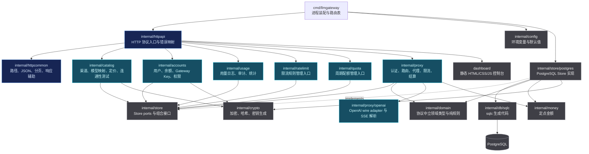
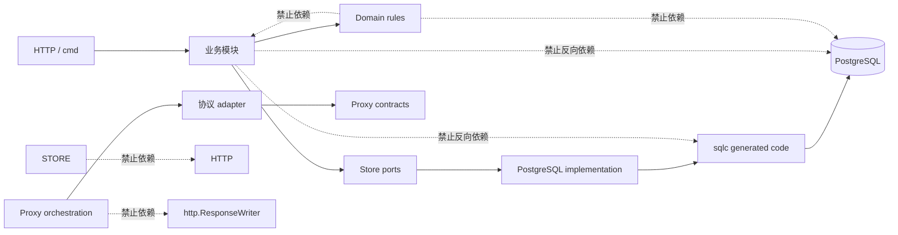
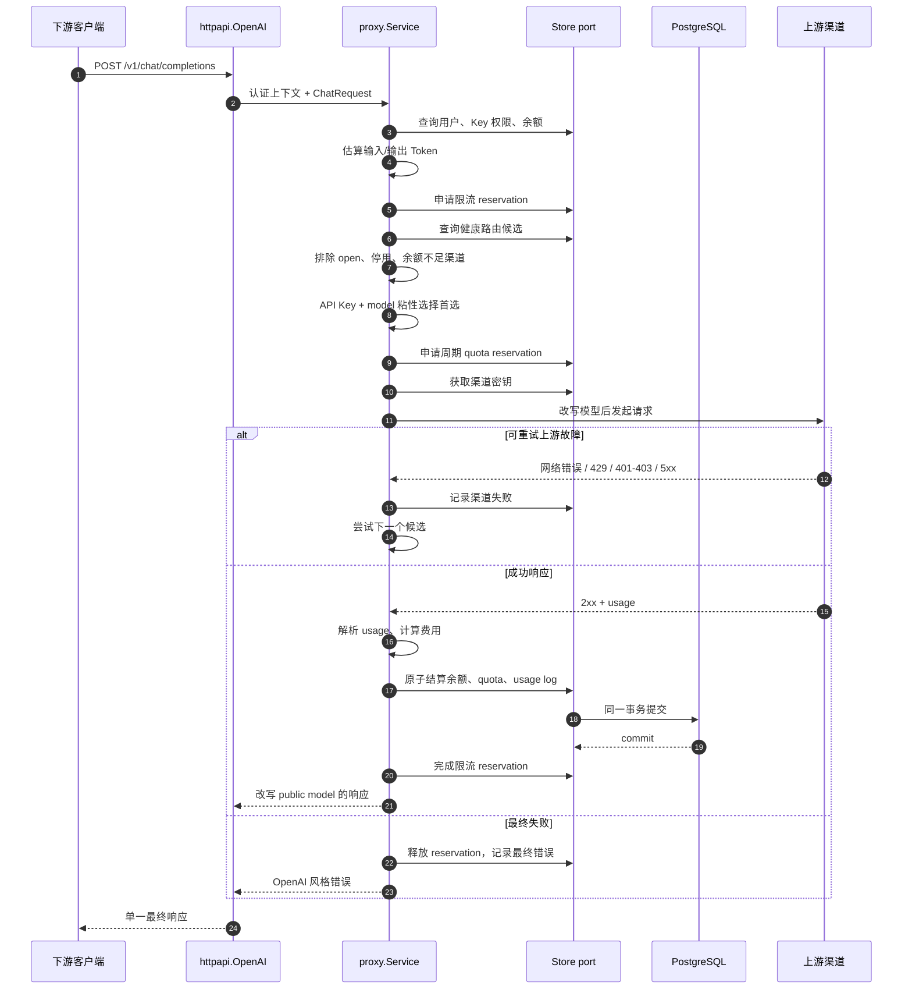
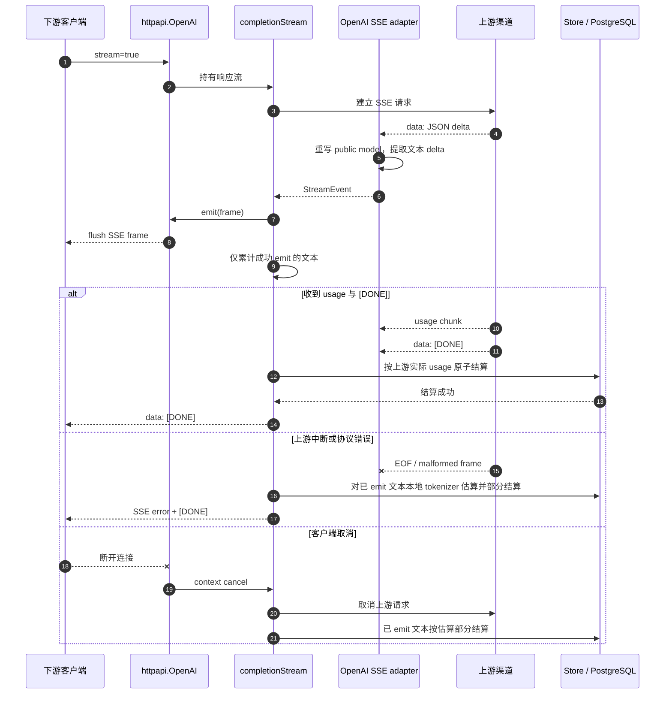
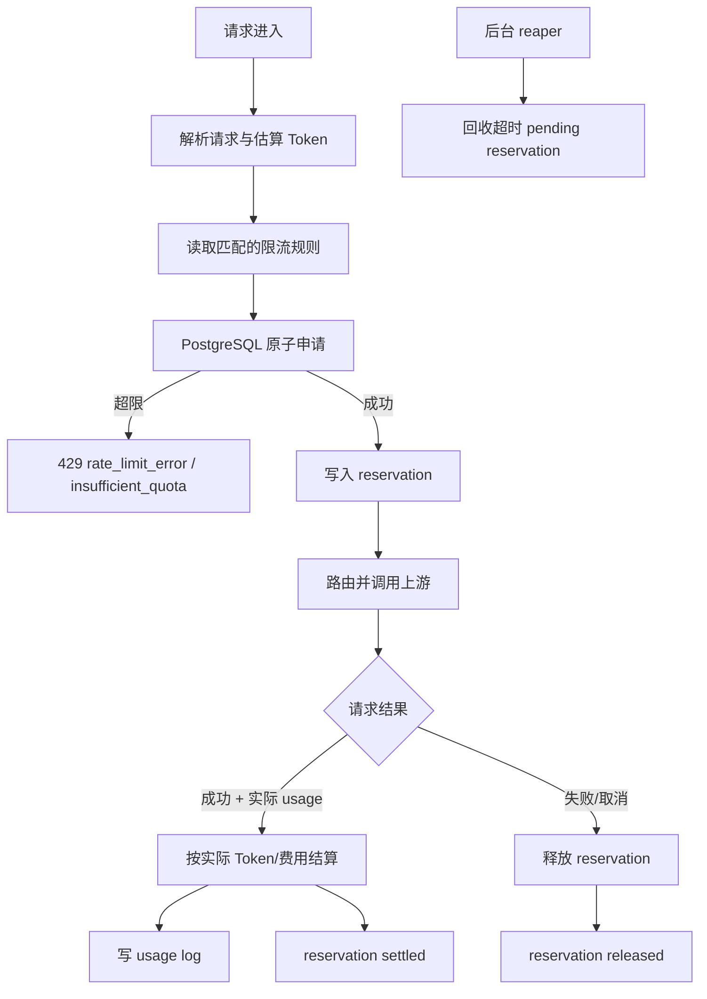
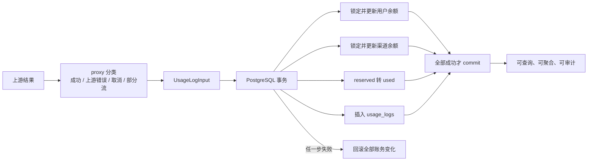

# 模块划分与数据流

本文描述 LLMGateway 的业务模块边界、依赖方向和主要请求数据流。模块划分按业务能力组织，不按 `handler`、`service`、`utils` 等技术层横向堆叠。

## 一、模块总览

### 1. 顶层装配与 HTTP 入口

- `cmd/llmgateway` 负责进程启动、优雅关闭、数据库初始化和顶层路由表。
- `internal/httpapi` 负责 HTTP 方法校验、请求体读取、统一错误映射、Dashboard 托管和业务模块委托。
- `internal/httpcommon` 只提供跨模块的 HTTP 辅助能力，不承载渠道、计费、路由或限流规则。
- 路径到入口的映射集中在 `cmd/llmgateway/router.go`，避免业务模块各自注册顶层路由。

### 2. 业务模块

#### `catalog`

拥有渠道、模型映射、定价和渠道连通性测试。它负责管理端渠道资源，但不负责下游请求的选路、重试和结算。

#### `accounts`

拥有用户、余额、Gateway Key、Key 权限和认证上下文。Gateway Key 只保存哈希，渠道 API Key 的加密由 `crypto` 提供。

#### `usage`

拥有 usage log、审计查询和统计接口。它提供查询和统计能力，但成功请求的账务日志由 proxy 通过 Store 结算端口写入。

#### `ratelimit`

拥有限流规则管理入口。速率规则的运行时编排属于 `proxy`，持久化端口属于 `store`。

#### `quota`

拥有 UTC 日/月周期配额管理入口。周期配额和短窗口限流使用不同的持久化模型，不能互相复用。

#### `proxy`

拥有下游请求的业务编排：认证、模型权限、路由、渠道健康、故障切换、限流、配额预留、上游请求、计费和结算。它是跨领域协调者，但不直接依赖 PostgreSQL、pgx 或 HTTP `ResponseWriter`。

#### `proxy/openai`

只负责 OpenAI 兼容协议边界：请求解析、请求改写、响应改写、SSE 解析、usage 提取和本地 Token 估算。它通过 `proxy.ProtocolAdapter` 向协议中立的 proxy 提供能力。

### 3. 共享领域与基础设施

- `domain` 放协议中立、存储中立的类型和纯规则，例如路由候选、失败原因、熔断状态、限流规则和金额相关业务输入。
- `store` 定义持久化 port；业务模块依赖接口，不依赖 PostgreSQL 实现。
- `store/postgres` 是生产 Store 唯一实现，负责事务、锁、SQL 错误映射和敏感数据解密。
- `db/sqlc` 是生成代码，源头是 `db/queries` 和迁移文件，禁止手改生成文件。
- `money` 是定点金额叶子包，禁止业务模块重复实现金额计算。
- `crypto` 是密钥加密、哈希和生成叶子包，禁止通过日志、响应或错误泄露密钥。

## 二、依赖方向

依赖方向的核心原则是：业务模块表达业务意图，Store 实现持久化细节，HTTP 层表达外部协议，协议 adapter 处理 wire 细节。任何一层越过边界直接操作另一层，都会增加测试、替换实现和后续扩容的成本。

## 三、非流式请求数据流

### 请求中的状态所有权

一次请求中有三类状态：

1. **请求级状态**：request ID、context、候选顺序和最终候选，由 proxy 持有。
2. **临时资源占用**：限流和 quota reservation，由 Store 持久化并以状态机完成或释放。
3. **最终账务事实**：余额变化、usage log 和实际 quota 使用量，在 PostgreSQL 事务中提交。

故障切换只改变候选和渠道健康，不创建新的用户请求 ID，也不创建第二笔最终账单。

## 四、流式 SSE 数据流

流一旦向下游写出数据，就不再切换到其他渠道。这样做牺牲了中途续接能力，但避免重复内容、重复生成和无法解释的账务。

## 五、限流与配额数据流

限流 reservation、周期 quota reservation 和成功结算的 quota 状态不能用进程内变量表达。进程内变量只能用于缓存或性能优化，不能作为多实例环境的最终计数。

## 六、用量与账务数据流

`usage_logs.request_id` 的唯一约束和 reservation 状态共同防止重复成功结算。管理端统计从 usage_logs 聚合；未来增加 rollup 时，rollup 只是读模型，不能替代 usage_logs 事实表。

## 七、扩展时的边界

### 可以独立扩容的部分

- `proxy` 多实例：只要共享 PostgreSQL，路由和账务可以横向扩展。
- Dashboard/管理端：可以与代理请求进程分离部署。
- 统计读路径：可以增加异步 rollup 或只读数据库连接。
- 短窗口限流：高吞吐时可以迁移到 Redis/Lua，但必须定义数据库与 Redis 的一致性边界。

### 不应直接拆开的部分

- 余额扣减、quota 结算和成功 usage log：必须保持同一账务事务语义。
- 流式输出和 settlement：流式完成的判定依赖 `[DONE]`、usage 和客户端写入状态，不能简单丢到异步队列后“最终再扣费”。
- 渠道健康状态与路由筛选：健康状态可以由 Store 管理，但路由必须在尝试前读取有效状态。

### 诊断问题的顺序

当请求失败时，先按以下顺序定位：

1. 客户端是否取消或请求 context 是否超时。
2. 是否被用户余额、配额或限流拒绝。
3. 是否没有健康候选或余额阈值排除了全部渠道。
4. 上游是否返回可重试故障，故障切换是否用尽。
5. 上游是否已写出流，是否进入部分结算。
6. 最终账务事务是否提交，reservation 是否 settled/released/expired。

这个顺序将“请求没有发出去”“上游失败”“已经产生部分交付”和“账务没有提交”区分开，避免把所有错误都归结为上游不可用。
